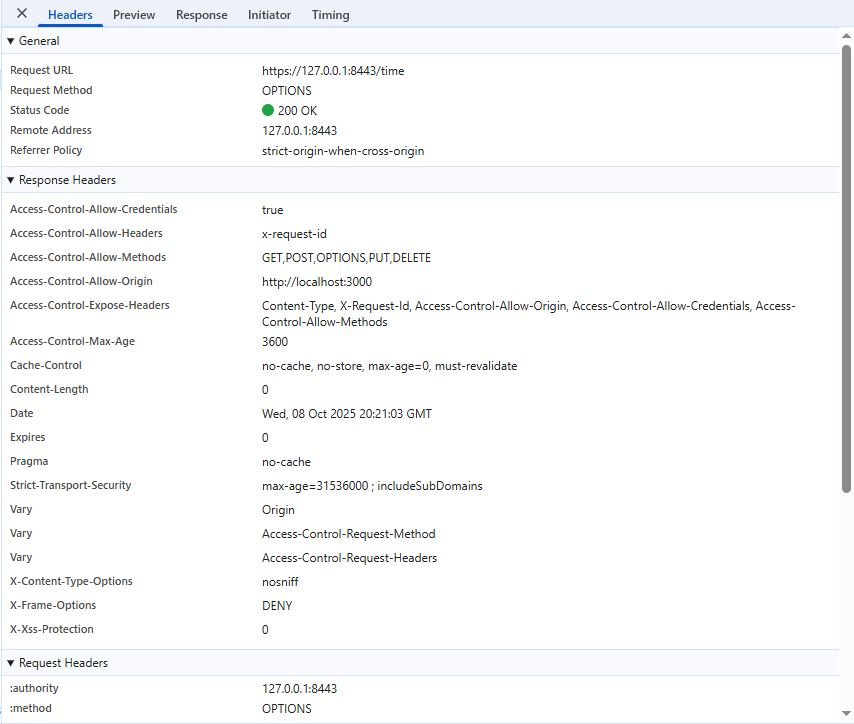
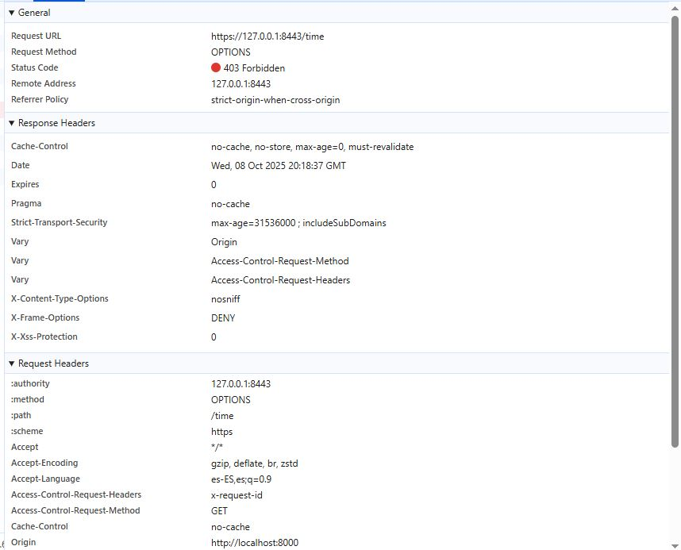

# Lab 2 Web Server -- Project Report

## Description of Changes
### 1. Customize the Whitelabel Error Page

A custom error page (`error.html`) was implemented to replace Spring Boot’s default Whitelabel error page. This page provides a clearer and more user-friendly error experience while **displaying essential diagnostic details** such as the HTTP status code, the requested path, and the timestamp of the error occurrence. To enhance visibility and debugging, **additional error details** such as the exception message and stack trace are exposed by enabling specific properties in `application.properties`. Integration test were developed to ensure the custom page correctly renders expected fields and displays accurate information.

### 2. Add /time Endpoint

A new /time endpoint was created to return the current server time in a well-structured JSON format. The implementation includes a complete set of components: a Data Transfer Object (**DTO**) for representing the response, a **TimeProvider** interface for different implementations of time retrieval, a concrete service implementation, and a **TimeController** that exposes the endpoint. Additionally, an **extension function** LocalDateTime.toDTO was implemented to convert time data into the appropriate DTO representation. The endpoint has been thoroughly tested using both **unit and MVC tests**. Unit tests verify that the controller correctly returns the DTO when provided with a mocked TimeProvider, while MVC tests confirm that the endpoint returns properly formatted JSON and responds as expected to HTTP requests.

### 3. Enable HTTP/2 and SSL Support
Full HTTP/2 and SSL support were added to enhance communication security and performance. A **PKCS12 keystore** was created to store the project’s SSL certificate. Spring Boot was configured to enable SSL and HTTP/2 in the application.yml file.

> [!WARNING]  
> **Sensitive information, including keystore passwords and paths, is excluded from version control for security reasons and is instead stored in a separate configuration file, application-secrets.properties**. This file contains properties such as KEY_STORE (path to the keystore) and SSL_PASSWORD (password for the keystore). This separation of secrets from the main configuration aligns with best practices for secure configuration management.

### 4. Implement Logging with SLF4J and Logback

A comprehensive structured logging system was implemented using SLF4J and Logback, providing full observability, request tracing, and secure log handling. The logging architecture consists of three key components:

* **CorrelationIdFilter**: Implements distributed tracing by managing correlation IDs. Each HTTP request receives a **unique X-Request-Id**, stored in SLF4J’s MDC (Mapped Diagnostic Context), and propagated across all log statements and HTTP responses.

* **RequestLoggingFilter**: Captures detailed request/response data, measures execution time, and routes logs dynamically to either internal or outbound loggers **based on the URI**. Sensitive headers such as Authorization and Cookie are automatically masked to protect user data. Logs are serialized to structured JSON format using Jackson’s ObjectMapper, enabling easy future parsing by tools like ELK or Splunk.

* **Logback Configuration** (logback-spring.xml): Defines environment-aware logging strategies. In development and production, logs use the **INFO** level for efficiency; in tests, **DEBUG** is enabled for deep inspection. Separate log files (internal.log and outbound.log) are maintained, with all logs encoded in JSON format using the LogstashEncoder for compatibility with centralized logging systems.

### 5. Enable CORS (Cross-Origin Resource Sharing) Support

CORS support was implemented via a centralized configuration class `CorsConfig`, annotated with `@Configuration` and `@EnableWebSecurity`. The configuration defines explicit CORS policies, including allowed origins, methods, headers, and credentials settings. Allowed origins are dynamically loaded from application properties using the `@Value` annotation. This allows different profiles (e.g., dev, test) to have distinct allowed origins without code changes. For instance, in our case, `http://localhost:3000,http://127.0.0.1:3000` for **development** and `http://testclient.local` for **testing**.

CORS settings permit standard HTTP methods (`GET, POST, PUT, DELETE, OPTIONS`) and common headers such as `Authorization, Content-Type, Cookie, User-Agent and X-Request-Id`. Credentials are allowed, enabling secure cross-domain cookie and authentication header use. The configuration avoids wildcard (*) origins when credentials are enabled, adhering to CORS security best practices.

The configuration is integrated with Spring Security through a custom SecurityFilterChain, which enables CORS handling before other security filters and allows all OPTIONS preflight requests. This ensures correct handling of browser preflight checks. Comprehensive tests were developed to validate preflight OPTIONS requests, credentialed GET requests, and origin-based rejection. Each profile has its own configuration and tests to verify that the correct properties are loaded dynamically at runtime.

### 6. Comprehensive Test Coverage

The project includes extensive tests covering all implemented configurations and functionalities. Unit, MVC, and Integration tests verify the correctness of controllers, filters, CORS behavior, and the error page. Mocking is used where appropriate to isolate components, while integration tests confirm correct behavior in full application contexts. **Tests also validate profile-specific configurations** (dev, test) to ensure that environment-dependent properties such as CORS origins and logging levels are correctly applied.

### 7. CI workflow:

A GitHub Actions workflow is configured to automatically run all tests on every commit. This CI process ensures continuous verification of application integrity and prevents regressions. **Test results are saved as downloadable artifacts**.

---

## Technical Decisions
Several deliberate technical decisions were made during implementation:

- **Separation of concerns**: Independent servlet filters were implemented for correlation IDs and request logging, following the Single Responsibility Principle. The CorrelationIdFilter executes early in the filter chain to guarantee that the correlation ID is available before any other logging occurs, while the RequestLoggingFilter extends OncePerRequestFilter to ensure single execution per request.

- **Profile-based configuration**: Environment-specific properties (application-dev.yml, application-test.yml) enable flexible configuration without code duplication. Environment-specific logging and cors configurations are isolated through Spring profiles, promoting maintainability and secure deployment practices.

- **XML-based logback configuration**: XML was chosen due to its mature support for complex and profile-aware configurations, as well as its extensive documentation available on the Internet. The <springProfile> tags in `logback-spring.xml` provide clean separation between environments, while broad community adoption make XML the most stable and well-documented option for Logback in the Spring ecosystem.

- **Dynamic logger selection**: Loggers are dynamically chosen based on request URIs to distinguish internal and external operations. This approach enables more targeted monitoring and quicker identification of whether performance issues originate within the application or from external dependencies. In my implementation, the /time endpoint and any URI beginning with /external are considered outbound operations and are logged using the outboundLogger. All other requests are treated as internal and logged through the internalLogger.

- **Adaptive log level selection**: The decision to control log levels adaptively (DEBUG in testing, INFO in production) via `logger.isDebugEnabled` rather than directly inspecting Spring profiles results in more flexible and maintainable code. This strategy delegates log level decisions to Logback’s configuration.

- **Centralized CORS and security management**: CORS configuration is integrated directly into Spring Security. This centralization ensures consistent policy enforcement, proper handling of preflight requests, and seamless integration with authentication mechanisms.

- **Secure configuration handling**: Sensitive data such as secrets and certificates are externalized in application-secrets.properties, following best practices for secure configuration management. CORS allowed origins are defined per environment, avoiding wildcards and explicitly listing trusted sources. This approach aligns with the principle of least privilege and prevents accidental exposure of protected resources.

- **Comprehensive testing strategy**: Automated tests validate CORS behavior, configuration loading, and filter interactions across multiple profiles (test, dev). These tests confirm that externalized configurations, security rules, and logging behaviors remain consistent and reliable across environments.

---

## Learning Outcomes
I began this lab by learning how to customize error handling in Spring Boot. By default, Spring Boot automatically generates simple error pages for common HTTP errors (such as 404). However, it is possible to replace these with a fully customized error.html page located in the `src/main/resources/templates` directory. Using **Thymeleaf**, the error page can dynamically display information about the error by leveraging **built-in variables** such as `${status}, ${exception}, ${trace}, and ${message}`.

After that, I explored how to configure SSL and HTTP/2 support in Spring Boot. To achieve this, I created a **self-signed certificate**, which generates a public-private key pair used to encrypt communication between the client and the server. With that certificate, I built a **PKCS12 keystore (.p12 file)** and configured Spring Boot to use it for HTTPS connections by specifying the keystore path and password in the application’s configuration file.

Additionally, I learned how to **separate sensitive data**, such as keystore passwords, into a dedicated application-secrets.properties file. This file is excluded from version control (using .gitignore) to prevent exposing confidential information in public repositories, following good security and DevOps practices.

Through this lab, I also gained a comprehensive understanding of **Cross-Origin Resource Sharing (CORS)** and its role in modern web applications. One key insight I learned is that, while CORS is originally a browser-enforced policy designed to prevent unauthorized cross-origin access from client-side scripts, frameworks like Spring Boot can extend its enforcement to the server side. By integrating CORS with Spring Security, the server inspects the Origin header of incoming requests and can reject requests from disallowed origins before they reach the application logic. This server-side validation means that even requests made from tools outside the browser, such as **MockMvc** or Postman, will be blocked if the origin is not permitted. This helped me understand that CORS in a modern web application is not just a client-side concern, but can be enforced at multiple levels for stronger security.

A practical and highly illustrative exercise involved **testing our CORS configuration using a minimal HTML file served via Python's built-in HTTP server** (`python -m http.server`).

#### **HTML file (index.html)**:
```
<!DOCTYPE html>
<html>
<body>
<script>
fetch("https://127.0.0.1:8443/time", {
  method: "GET",
  headers: { "X-Request-Id": "123" }
})
  .then(res => res.text())
  .then(console.log)
  .catch(console.error)
</script>
</body>
</html>
```

By hosting the HTML on a different port than our Spring Boot application, we simulated a real cross-origin scenario. This hands-on experiment made CORS behavior immediately visible in the **browser’s developer console**, including preflight requests, actual requests, and any errors. When the page was served on **port 3000**, the browser successfully made the request because this origin was explicitly allowed in our CORS configuration. In the developer console, we could observe the preflight OPTIONS request and see the CORS-related headers returned by the server, such as Access-Control-Allow-Origin and Access-Control-Allow-Methods.




However, when hosting the same HTML file on **port 8000**, the request was rejected with a ***403 Forbidden*** error because that origin was not included in the allowed list. In this case, the browser’s response did not contain any Access-Control-* headers, clearly showing that the request was blocked by the CORS policy.




To better **conceptualize CORS and Spring Security**, I developed a simple analogy: think of the application as a building with two levels of security. **CORS** acts as a **security guard** at the entrance, only allowing visitors from approved origins and for allowed actions. For example, requests from localhost:3000 using GET, POST, PUT, or DELETE are permitted, while unknown domains are blocked at the door. Once past the CORS guard, **Spring Security** functions like a **receptionist** inside the building, checking whether visitors have the proper credentials to access certain areas. This analogy clarified the layered nature of security: CORS checks occur first at the browser and server level, while authentication and authorization are enforced afterward by Spring Security.

During the lab, I encountered and resolved several **testing challenges**. Initially, using @WebMvcTest did not load my CORS configuration (e.g., in TimeControllerMVCTests), resulting in 401 Unauthorized errors. I learned that @WebMvcTest creates a minimal Spring context, which excludes some configurations such as custom CORS or security beans. To fix this, I had to explicitly import the security configuration using `@Import(CorsConfig::class)`. This experience deepened my understanding of Spring’s test slice annotations and their **scoping** implications, teaching me how to maintain isolation while ensuring essential components are available during tests.

Another important part of this lab involved implementing and testing a robust logging infrastructure. The system outputs logs to **multiple destinations simultaneously**: console output for real-time monitoring during development, and separate log files for persistence and analysis. **Two distinct log files** are maintained: logs/internal.log for application-level logs and logs/outbound.log for external service interactions. All appenders use the LogstashEncoder from the logstash-logback-encoder library, which automatically generates JSON-formatted logs with **standard fields** such as timestamp, log level, logger name and thread name. **Custom fields** are added to distinguish the application (`"application":"lab2-web-server"`) and log type (`"type":"internal" or "type":"outbound"`), facilitating filtering and routing in future centralized logging systems.

The practice of profile-based configuration demonstrated how the same codebase can adapt to different operational environments. **Test profiles** require verbose **DEBUG** logging to facilitate troubleshooting test failures. **Development environments**, on the other hand, benefit from INFO level logging that provides useful feedback without overwhelming developers. This assignment illustrated how Logback’s XML configuration, combined with Spring’s profile system, enables flexible and environment-specific behavior without scattering conditional logic throughout the application code.

Furthermore, the implementation provided valuable exposure to testing logging infrastructure, which poses unique challenges compared to testing functional code. By **using a ListAppender** to capture log events in memory during tests, verifying JSON structure with **Jackson’s ObjectMapper**, and asserting that correlation IDs propagate correctly, I gained hands-on experience with Logback’s programmatic API beyond configuration alone. The use of **@DirtiesContext** and **@TestPropertySource** highlighted Spring Boot’s test isolation mechanisms and emphasized the importance of preventing context pollution between tests.

Finally, this lab highlighted the importance of **externalized and environment-specific configurations** for building maintainable applications. By defining parameters such as CORS policies (allowed-origins) and logging levels in profile-based property files, the application adapts seamlessly across environments without code changes. 

---

## AI Disclosure
### AI Tools Used

ChatGPT

### AI-Assisted Work

**What was generated with AI assistance**
AI was used for:

* Create the design of the custom error page (error.html).
* Helping with the configuration of logback-spring.xml, particularly ensuring that the correct INFO and DEBUG log levels were applied dynamically based on the active Spring profile, a process that required several iterations to get right.
* Generating initial skeletons for tests related to logging and CORS configuration across different Spring profiles.
* Providing guidance and validation steps for verifying that the CORS configuration worked correctly using a simple Python HTTP server and an HTML test file (index.html presented in this report).
* Improving the clarity, structure, and consistency of this `report.md` document by providing an initial draft and editorial suggestions.
* Reviewing and validating that the logging and CORS implementations met all functional and security requirements before final submission.

**Percentage of AI-assisted vs. original work**: Approximately **50%** of the work was AI-assisted. This mainly included early drafts of test skeletons for CORS and logging, portions of the Logback configuration, and improvements with this report.

**Any modifications made to AI-generated code**: All AI-generated content (test skeletons, configurations, and report sections) was thoroughly reviewed, adapted, and modified to ensure accuracy, alignment with project requirements, and compliance with clean coding practices. Nothing was used without verification and adjustment to fit the project’s goals.

### Original Work

The main source files (`CorsConfig.kt, CorrelationIdFilter.kt, RequestLoggingFilter.kt`), as well as the core test classes (`TimeControllerMVCTests.kt, TimeControllerUnitTests.kt, and ErrorPageIntegrationTest.kt`) were primarily developed by me. For this test classes, reusing portions of the base code from MVC and unit tests of the previous lab practice proved highly valuable and significantly streamlined the development process.

My learning process was based on studying the **codebase provided by the professor** and **reviewing key sections of some technical articles** that guided the implementation of logging and CORS configuration:
* [Spring Boot Logs Aggregation and Monitoring Using ELK Stack - Auth0 Blog](https://auth0.com/blog/spring-boot-logs-aggregation-and-monitoring-using-elk-stack/#Creating-a-Spring-Boot-Application). Used to understand the initial setup and structure of the logback-spring.xml configuration.

* [Understanding and Implementing Correlation ID in Microservices - Medium](https://medium.com/@anil.goyal0057/understanding-and-implementing-correlation-id-in-microservices-2900518954a0). Provided valuable insight into how to implement the Correlation ID pattern for distributed request tracing.

* [CORS in Spring Boot with Kotlin - Medium](https://medium.com/@tcbasche/cors-in-spring-boot-with-kotlin-55eb5385f0e). **Very helpful for configuring CORS** correctly in a Kotlin-based Spring Boot project.

As mentioned earlier, AI assistance was used specifically for refining profile-based logging configuration and improving the Logback XML setup. However, all CORS and logging configuration tests were further refined, validated, and finalized by me to ensure they met all project and testing requirements.
